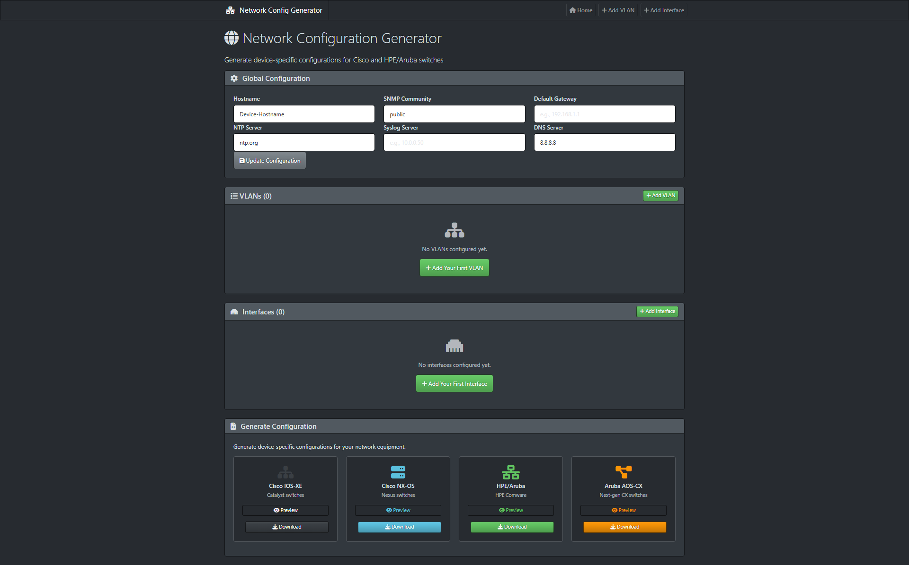
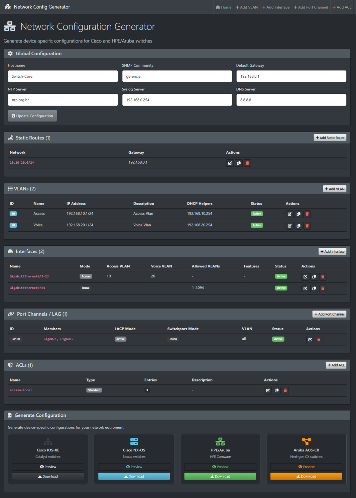
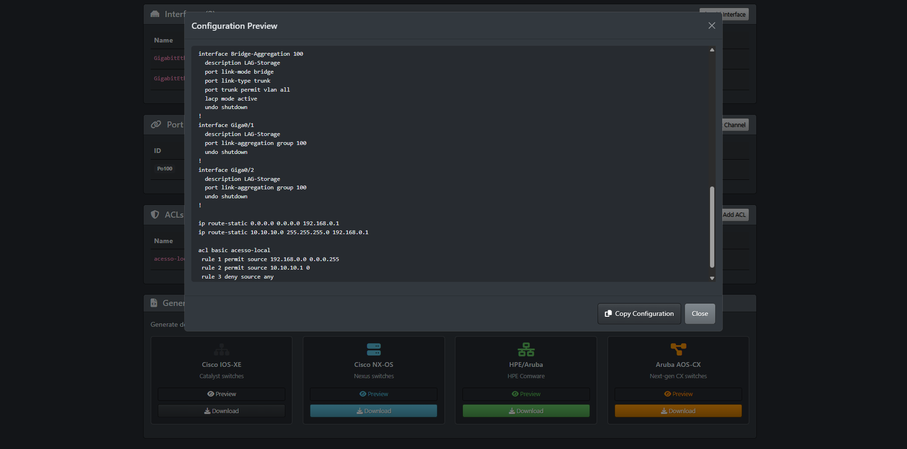

  

# NetConfGen

[Read this in english](README.en.md)

NetConfGen é uma ferramenta projetada para simplificar o trabalho de qualquer pessoa que configure dispositivos via linha de comando.

Seja você analista de redes, de testes ou estudante que está sempre lidando com equipamentos de diversas marcas, esse é o jeito mais rápido de configurar seus dispositivos sem erros de digitação e sem complicação.

Em vez de consultar manuais de sintaxe para cada fabricante, você apenas insere na interface os dados da configuração desejada e o aplicativo transforma tudo em arquivos de configuração prontos para uso.

Assim, você foca no projeto e o app cuida de gerar o código certinho para cada aparelho.

## Plataformas Suportadas

- **Cisco IOS-XE**
- **Cisco NX-OS**
- **HPE/Aruba Comware**
- **Aruba AOS-CX**

## Funcionalidades

- **Configurações de VLANs**: Adicione, edite, exclua e duplique VLANs de dados e voz.
- **Gerenciamento de interfaces**
  - **Modos Access e Trunk** Configuração de interfaces de acesso ou trunk
  - **Intervalos de Porta** Configure intervalos de portas usando notação padrão (por exemplo, `1/1-48`, `Giga0/1-24)`).
  - **Roteamento L3** Para AOS-CX, alterna a configuração das portas entre os modos `routing` e `no routing`.
- **Port-Channel / LAG**: Configure agregação de links com LACP (ativo/passivo) ou modo estático.
  - IOS-XE: `Port-channel` + `channel-group mode`
  - NX-OS: `port-channel` + `channel-group mode`
  - HPE/Aruba: `Bridge-Aggregation` + `port link-aggregation group`
  - AOS-CX: `lag` + vínculo de interfaces membro
- **Rotas Estáticas** Adicione várias rotas estáticas (rede/prefixo/gateway) além da rota padrão.
- **Serviços Globais**
  - **Servidores NTP**
  - **Hosts Syslog**
  - **Servidores DNS**
  - **Comunidades SNMP**
  - **Gateway Padrão**

## Screenshots
<details>
<summary> Clique aqui para ver os Screenshots </summary>
<br>







</details>

## Como Começar

1. Clone o repositório:
   ```bash
   git clone https://github.com/solopx/netconfgen.git
   ```
2. Acesse o diretório:
   ```bash
   cd netconfgen
   ```
3. Instale as dependências:
   ```bash
   pip install -r requirements.txt
   ```
4. Execute a aplicação:
   ```bash
   python main.py
   ```
5. Abra o navegador e acesse:
   ```bash
   http://localhost:5000
   ```

## Como Funciona

1. **Configuração Global**: Defina o hostname do dispositivo, servidores de gerência e gateway padrão.
2. **Rotas Estáticas**: Adicione rotas estáticas adicionais além da rota padrão.
3. **VLANs**: Criação e edição de VLANs
4. **Mapeamento de Interfaces**: Associe portas a VLANs ou configure trunks.
5. **Port Channels**: Defina grupos LAG/EtherChannel e suas interfaces.
6. **Gerar e Exportar**: Selecione a plataforma de destino e baixe a configuração pronta para o CLI.

## Notas Importantes

- **Segurança em Primeiro Lugar**: Sempre revise e valide as configurações geradas em ambiente de laboratório antes de aplicar em produção.

- **Armazenamento em Memória**: Por segurança e simplicidade, esta versão armazena os dados em memória volátil. As configurações são apagadas quando o servidor é reiniciado.

## Licença
Este projeto está licenciado sob a MIT License — sinta-se à vontade para modificar e usar conforme sua necessidade.
